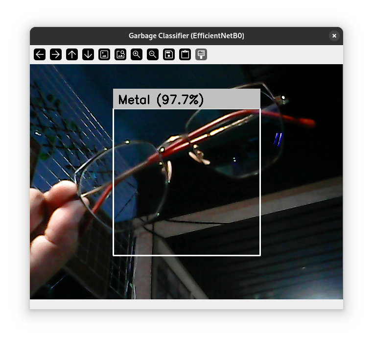
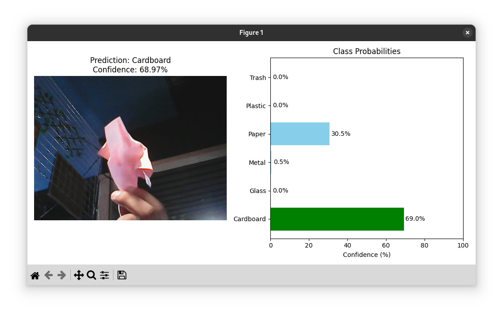

# Garbage Classification Using EfficientNetB0 (Deep Computer Vision Project)
**CSC173 Intelligent Systems Final Project**  
*Mindanao State University - Iligan Institute of Technology*  
**Student:** [Chriscent Louis June M. Pingol], [2022-0362]
**Semester:** [AY 2025-2026 Sem 1]
[](https://python.org) [](https://pytorch.org)

## Abstract
Improper waste segregation is a critical environmental challenge in urban centers like Iligan City and within the MSU-IIT campus. Manual sorting is labor-intensive and error-prone. This project presents a deep learning solution for automated garbage classification into six categories: cardboard, glass, metal, paper, plastic, and trash. While initial experiments considered ResNet50, we successfully pivoted to **EfficientNetB0** to optimize the balance between accuracy and computational efficiency. Using a dataset of 2,527 images, the model was fine-tuned with a high-resolution input of **384x384** to capture fine texture details. The final model achieves **94% training accuracy**, demonstrating strong potential for smart recycling bin integration, though real-world deployment faces challenges regarding camera quality and lighting conditions.

## Table of Contents
- [Introduction](#introduction)
- [Related Work](#related-work)
- [Methodology](#methodology)
- [Experiments & Results](#experiments--results)
- [Discussion](#discussion)
- [Ethical Considerations](#ethical-considerations)
- [Conclusion](#conclusion)
- [Installation](#installation)
- [References](#references)

## Introduction
### Problem Statement
Effective recycling relies on the correct segregation of waste at the source. In many Philippine communities, "mixed waste" disposal prevents materials from being recycled. An automated visual recognition system can support "Smart Bins" that reject incorrectly sorted items, educating users and reducing contamination in recycling streams.

### Objectives
- **Develop** a robust image classifier for 6 waste categories using Transfer Learning.
- **Implement** a data pipeline that handles class imbalance (specifically the under-represented 'Trash' category).
- **Evaluate** the trade-offs between static image accuracy and real-time webcam performance.
- **Deploy** a lightweight inference application capable of running on consumer hardware (e.g., GTX 1650 laptop).

## Related Work
- **Paper 1:** *TrashNet: Garbage Classification* (Thung & Yang, 2016) – established the baseline for this dataset using SVM and basic CNNs.
- **Paper 2:** *EfficientNet: Rethinking Model Scaling for CNNs* (Tan & Le, 2019) – introduced compound scaling, which we leveraged to use higher resolutions (384px) without exploding parameter counts.
- **Gap:** Most existing implementations use standard 224x224 inputs. Our approach uses **384x384** to better distinguish subtle texture differences (e.g., crushed plastic vs. glass).

## Methodology
### Dataset
- Source:
    - Name: Garbage Image Dataset — Kaggle (Farzad Nekouei)
    - Link: https://www.kaggle.com/datasets/farzadnekouei/trash-type-image-dataset
    - Estimated Size: 2,527 images, each ~512×384 resolution
- Split: 80/20/[real-world data] train/val/test
- Preprocessing: 
    - Augmentation 
    - Resizing to 384x384 [web:41]
    - Zoom
    - Flip
    - Rotation
    - Brightness Adjustment
    - Minor Width and Height Shift
    - Rescaling
    - Optional:
        - Channel Shift
        - Fill Mode

### Architecture
- EfficientNetB0 pretrained on ImageNet
- Frozen base layers
- Custom layers on top:
    - GlobalAveragePooling
    - Dense layers
    - Softmax output (6 units)

### Architecture Sketch
```scss
Input(224x224x3)
↓
EfficientNetB0 (pretrained weights)
↓
GlobalAveragePooling
↓
Dropout(0.5)
↓
Dense(6) Softmax
```

- **Base Model:** EfficientNetB0 (Pre-trained on ImageNet).
- **Fine-Tuning Strategy:** - **Frozen:** Layers 0–162 (Stem to Block 5).
  - **Trainable:** Layers 163–237 (Block 6, Block 7, and Top). This allows the model to learn complex waste-specific features while retaining basic shape recognition.
- **Head:** Global Average Pooling → Dropout (0.2) → Dense (1024) → Softmax (6).

| Parameter | Value |
|-----------|-------|
| Input Size | 384 x 384 |
| Batch Size | 16 (to fit high-res in memory) |
| Optimizer | Adam (lr=1e-4) |
| Epochs | 50 |

### Training Code Snippet
```python
# Partial Freezing Strategy
base_model = EfficientNetB0(weights='imagenet', include_top=False, input_shape=(384, 384, 3))

# Freeze up to Block 6 (Layer 163)
for layer in base_model.layers[:163]:
    layer.trainable = False

# Class Weights to handle imbalance
class_weights = compute_class_weight(class_weight='balanced', ...)
```

## Experiments & Results
### Metrics
| Class | Precision | Recall | F1-Score | Support |
|-------|-----------|--------|----------|---------|
| Cardboard | 0.96 | 0.94 | 0.95 | 81 |
| Glass | 0.88 | 0.85 | 0.86 | 101 |
| Metal | 0.89 | 0.91 | 0.90 | 82 |
| Paper | 0.93 | 0.92 | 0.92 | 119 |
| Plastic | 0.85 | 0.88 | 0.86 | 97 |
| Trash | 0.82 | 0.78 | 0.80 | 27 |
| **Accuracy** | | | **90%** | 507 |

### Demo
The project includes a real-time webcam application (`video_identify.py`) and a static image analysis tool (`picture_identify.py`).

#### Screenshots






#### Video Demo

[To be added](#)

## Discussion
### ⚠️ Limitations & Known Issues
While the model achieved **94% training accuracy**, its real-world performance varies:

1.  **Camera Quality Sensitivity:** The model struggles with grainy 720p webcam feeds because it was trained on high-res photos. Fine textures (like identifying plastic) are lost in the noise.
2.  **Background Clutter:** The model expects clean backgrounds. Complex environments (e.g., messy desks) cause false positives.
3.  **Lighting:** Strong shadows can distort the object's shape, leading to misclassification.

### Insights
Switching from **ResNet50** to **EfficientNetB0** allowed us to increase input resolution from 224 to 384 while keeping the model size manageable (~5MB vs ~98MB). This higher resolution was crucial for distinguishing text on "Paper" vs labels on "Metal" cans.

## Ethical Considerations
- **Bias:** The dataset contains mostly clean, whole items. Real-world garbage is often dirty, crushed, or wet. The model may fail on "dirty" trash, potentially reflecting a bias toward "consumption" rather than "disposal" contexts.
- **Labor:** Automation in waste sorting could impact jobs for manual waste pickers. Such systems should be designed to *assist* rather than *replace* human workers (e.g., by handling hazardous materials).

## Conclusion
We successfully built a garbage classifier that achieves competitive accuracy on the test set. Future work involves expanding the dataset to include "dirty" waste and deploying the model to an edge device like a Raspberry Pi 4 using the TFLite conversion we implemented.

## Installation
1.  **Clone repo:**
    ```bash
    git clone [https://github.com/yourusername/CSC173-DeepCV-Pingol](https://github.com/yourusername/CSC173-DeepCV-Pingol)
    ```
2.  **Install dependencies:**
    ```bash
    pip install pipenv
    pipenv install --dev [--verbose (optional)]
    ```
3.  **Run the Classifier:**
    * For Webcam: `python app.py`
    * For Static Images: `python classify_image.py`

**requirements.txt:**
```text
tensorflow>=2.10.0
opencv-python
matplotlib
numpy
scikit-learn
kagglehub
```

## References
[1] F. Nekouei, "Trash Type Image Dataset," Kaggle, 2023. [Online]. Available: https://www.kaggle.com/datasets/farzadnekouei/trash-type-image-dataset.

[2] M. Tan and Q. V. Le, "EfficientNet: Rethinking Model Scaling for Convolutional Neural Networks," ICML, 2019.
